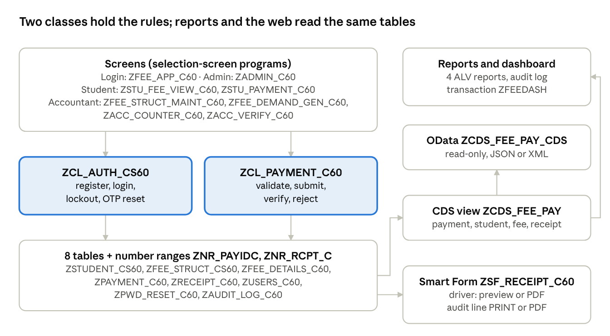
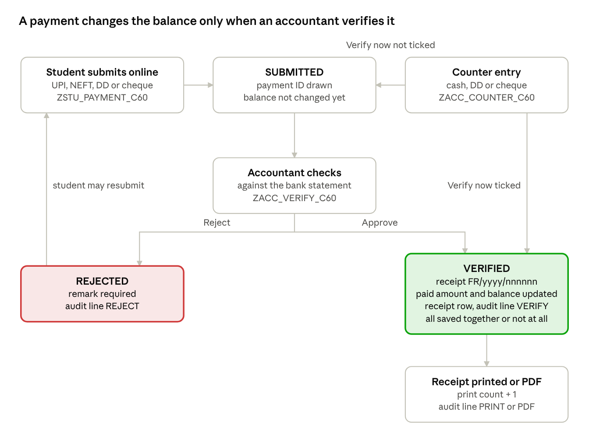
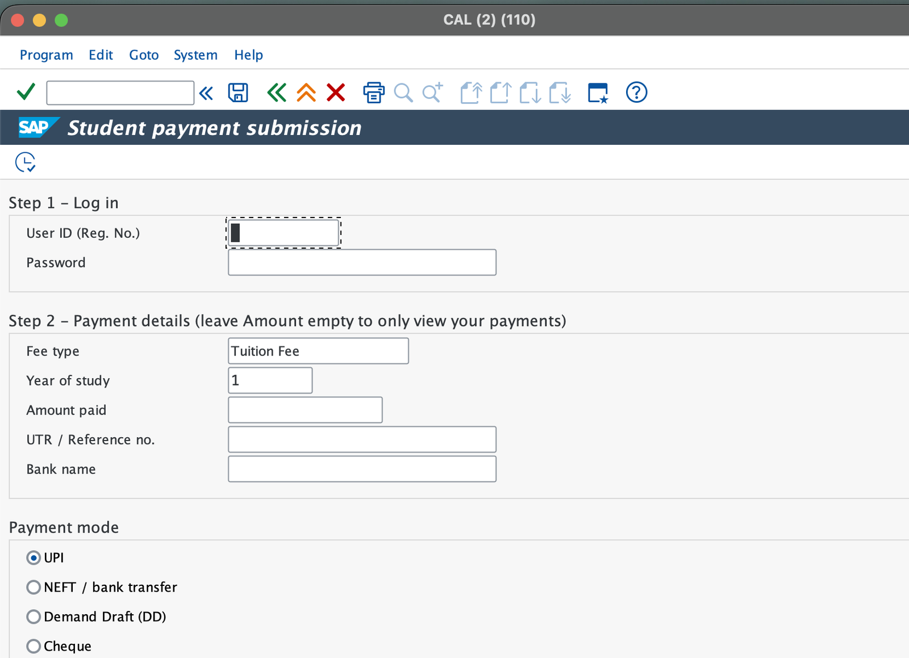
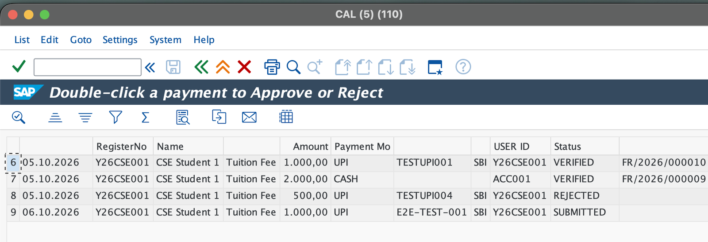
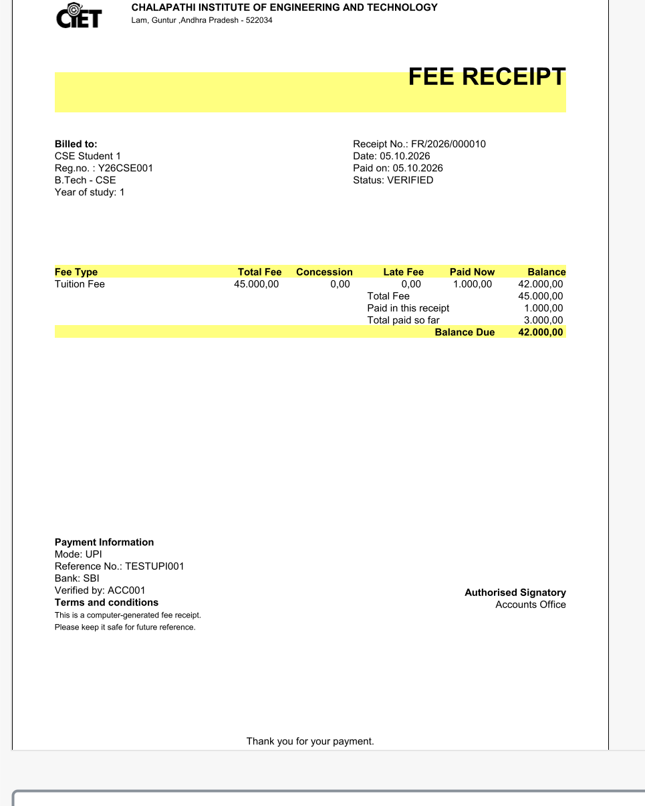
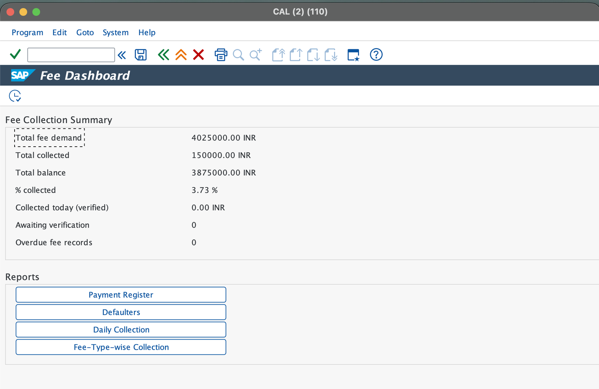
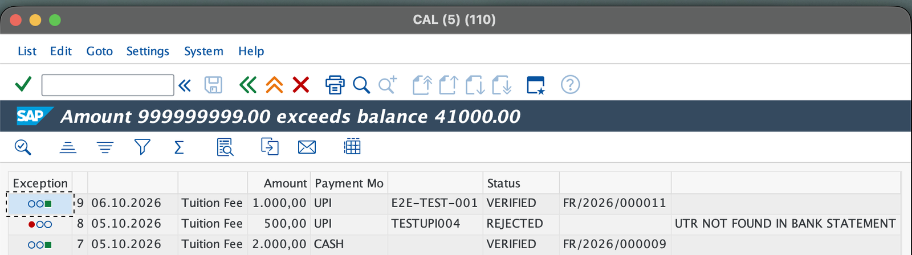
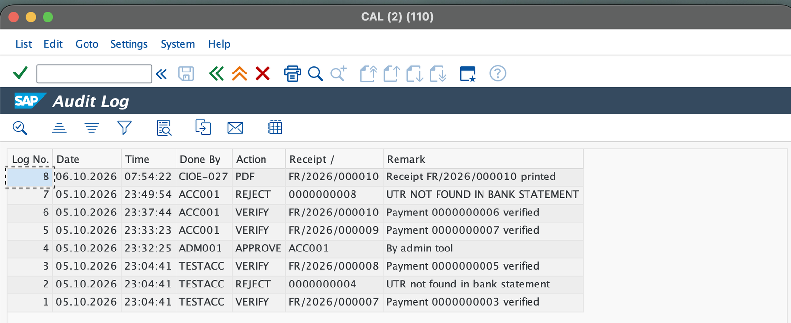

# College Fee Management & Receipt System (SAP ABAP)

A fee collection and receipting system for **Chalapathi Institute of Engineering and Technology**, built in SAP ABAP on S/4HANA 1809 by a team of 7 in 7 days.

Students record the payments they made through the bank (UPI, NEFT, DD, cheque). An accountant verifies each one against the bank statement, or records cash at the counter. Only then does the fee balance change and a numbered receipt get issued, which can be printed or saved as a PDF. Management sees collections and defaulters in ALV reports and a dashboard, and every action is written to an audit log. There is no payment gateway: SAP records and verifies payments the way a college accounts office does.



## Features

| Area | What it does |
| --- | --- |
| Login and security | Own registration and login (class `ZCL_AUTH_CS60`), salted SHA-256 password hashes, lockout after 3 wrong passwords, OTP password reset, accountants approved by an admin |
| Fee management | Fee price list per course, branch, year and fee type; bulk fee-demand generation with a test-run mode; student fee view with PAID / PARTIAL / UNPAID / OVERDUE lights |
| Payments | Student self-service submission, counter entry for cash, DD and cheque, accountant approval or rejection with a reason (class `ZCL_PAYMENT_C60`) |
| Receipts | Number range `FR/yyyy/nnnnnn`, Smart Form with college logo, print preview or PDF download, print counter |
| Reports | Payment register, defaulters, daily collection, fee-type-wise collection, audit log (ALV) and a KPI dashboard (transaction `ZFEEDASH`) |
| Integration | CDS view `ZCDS_FEE_PAY` published as OData service `ZCDS_FEE_PAY_CDS` |

## Payment lifecycle



Verification writes the new balance, the payment status and receipt number, the receipt row and the audit line in **one unit of work**. If any step fails, `ROLLBACK WORK` undoes all of them.

## Screenshots

| Student submits a payment | Accountant verifies |
| --- | --- |
|  |  |

| Fee receipt (Smart Form) | Dashboard (ZFEEDASH) |
| --- | --- |
|  |  |

| Business rule: overpayment blocked | Audit log |
| --- | --- |
|  |  |

More screenshots are in [`docs/screenshots`](docs/screenshots). The full project guide, with explanations, test results and reviewer Q&A, is in [`docs/College_Fee_System_Project_Guide.pdf`](docs/College_Fee_System_Project_Guide.pdf).

## Technology

- SAP S/4HANA 1809 (SAP_BASIS 753), SAP GUI for Java, Eclipse with ABAP Development Tools
- ABAP Dictionary (8 tables, domains, data elements, foreign keys), SNRO number ranges
- Object-oriented ABAP, selection-screen programs, ALV (`CL_SALV_TABLE`)
- Smart Forms with PDF output (`CONVERT_OTF`, `GUI_DOWNLOAD`)
- CDS view with `@OData.publish: true`, SAP Gateway
- `CL_ABAP_MESSAGE_DIGEST` for hashing

## Repository structure

```
src/
  classes/    zcl_auth_cs60, zcl_payment_c60            (business rules)
  programs/   student, accountant, receipt and dashboard programs
  reports/    four ALV reports and the audit log viewer
  cds/        zcds_fee_pay (CDS view + OData)
  tests/      ztest_payment_c60 (16 automated checks)
docs/
  College_Fee_System_Project_Guide.pdf
  data-model.md
  diagrams/, screenshots/
```

## Objects

| Object | Type | Purpose |
| --- | --- | --- |
| `ZCL_AUTH_CS60` | Class | Register, login, lockout, OTP reset, hashing |
| `ZCL_PAYMENT_C60` | Class | `VALIDATE`, `SUBMIT`, `VERIFY`, `REJECT` |
| `ZFEE_DEMAND_GEN_C60` | Program | Fee demand generation from the price list |
| `ZSTU_FEE_VIEW_C60` | Program | Student fee view |
| `ZSTU_PAYMENT_C60` | Program | Student payment submission and history |
| `ZACC_COUNTER_C60` | Program | Counter entry (cash, DD, cheque) |
| `ZACC_VERIFY_C60` | Program | Approve or reject submitted payments |
| `ZDRIVER_FEE_RECEIPT_C60` | Program | Receipt preview / PDF, print count, audit log |
| `ZFEE_DASH_C60` | Program (tcode `ZFEEDASH`) | KPI dashboard with report buttons |
| `ZRPT_PAY_REGISTER_C60` | ALV report | Payment register |
| `ZRPT_DEFAULTERS_C60` | ALV report | Balances past the due date |
| `ZRPT_DAILY_COLL_C60` | ALV report | Verified collections per day and mode |
| `ZRPT_FEETYPE_COLL_C60` | ALV report | Collection per fee type and branch |
| `ZRPT_AUDIT_C60` | ALV report | Audit log viewer |
| `ZCDS_FEE_PAY` | CDS view | Payment + student + fee demand + receipt; OData service |
| `ZTEST_PAYMENT_C60` | Test program | 16 checks on `ZCL_PAYMENT_C60` |

Not included in this repository: the login screens (`ZFEE_APP_C60`), admin tool (`ZADMIN_C60`), price-list maintenance (`ZFEE_STRUCT_MAINT_C60`), the Smart Form `ZSF_RECEIPT_C60` and the dictionary objects. Table definitions are documented in [`docs/data-model.md`](docs/data-model.md).

## How to install in your own SAP system

1. Create a package and a transport request.
2. Create the domains, data elements and 8 tables listed in [`docs/data-model.md`](docs/data-model.md), and activate them.
3. In SNRO, create number range objects `ZNR_PAYIDC` (NUMC 10) and `ZNR_RCPT_C` (NUMC 6), each with interval `01`.
4. Create the two classes from `src/classes` (SE24 or Eclipse) and activate them.
5. Create each program from `src/programs`, `src/reports` and `src/tests` in SE38, paste the code and activate.
6. Create the Smart Form `ZSF_RECEIPT_C60` with interface structure `ZST_FEE_103`.
7. In Eclipse, create the data definition `ZCDS_FEE_PAY` from `src/cds` and activate it.
8. Optional: register service `ZCDS_FEE_PAY_CDS` in `/n/IWFND/MAINT_SERVICE` (system alias `LOCAL`), and create transaction `ZFEEDASH` for `ZFEE_DASH_C60` in SE93.
9. Load test students, generate fee demands with `ZFEE_DEMAND_GEN_C60`, then run `ZTEST_PAYMENT_C60` to check the payment logic.

The file names follow the abapGit convention (`.clas.abap`, `.prog.abap`, `.ddls.asddls`). The repository holds source only, without abapGit metadata files, so create the objects by hand as described above.

## Testing

All 11 end-to-end tests passed on 06.10.2026: submission, approval with receipt, dashboard totals, receipt printing, overpayment and duplicate-reference blocks, rejection with a mandatory reason, audit entries and the OData service. Module tests: 9 login cases, 8 password-reset cases, 10 screen cases and 16 payment-class checks, all passing. Details are in the project guide.

## Why OData instead of RAP

A RAP business object needs SAP_BASIS 754 (S/4HANA 1909) or newer. The development system is SAP_BASIS 753 (S/4HANA 1809), so the CDS view was published as an OData service with `@OData.publish: true`, the option this release supports.

## Team

| Member        | Role                      |
| ------------- | ------------------------- |
| M.Vyshnavi    | Team lead / integration   |
| K.Gana Sai    | Database and data         |
| V.Vinod Kumar | Authentication logic      |
| T.Yoshitha    | Authentication screens    |
| S.Aswini      | Fee management            |
| S.Ramya       | Payments and verification |
| G.Ravi Kiran  | Receipt and reports       |

Chalapathi Institute of Engineering and Technology, 2026.
